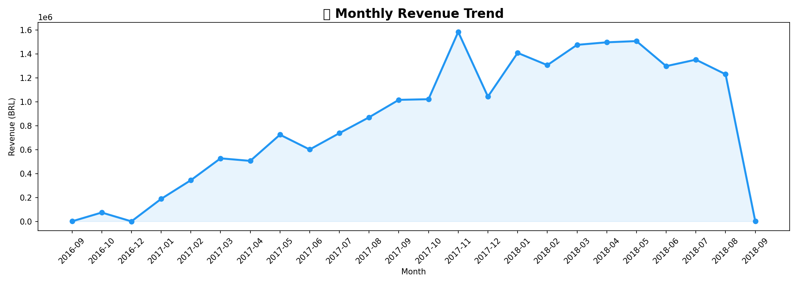

# 🛒 E-Commerce Sales Analytics & Forecasting System

## 📌 Project Overview
An end-to-end sales analytics and forecasting system built on 
100K+ real e-commerce orders. Includes SQL analysis, Python EDA, 
and a 90-day revenue forecast using Facebook Prophet.

## 🛠️ Tech Stack
- **Python** — Pandas, Prophet, Matplotlib, Seaborn
- **PostgreSQL** — Data storage & SQL analysis
- **Power BI** — Interactive dashboard
- **Google Colab** — Development environment

## 📊 Key Insights
- 💰 Total Revenue: **16.01M BRL** across 99K+ orders
- 🏆 Top Category: **beleza_saude** with 1.25M BRL revenue
- 📦 Delivery Rate: **97%** orders successfully delivered
- 📈 Peak Month: **May** highest revenue month
- 🔮 90-Day Forecast: **5.09M BRL** predicted revenue

## 📁 Project Structure
Flipkart_Sales_Project/
├── 1_Data/
│   ├── raw/          ← Original Kaggle dataset
│   └── processed/    ← Cleaned master dataset
├── 2_SQL/
│   └── analysis_queries.sql
├── 3_Notebooks/
│   └── 01_data_cleaning.ipynb
├── 4_Dashboard/
│   └── sales_dashboard.pbix
└── 5_Outputs/
├── charts/       ← All visualizations
└── forecast_results.csv

## 🔍 SQL Analysis Performed
- Total revenue & order metrics
- Top 10 product categories by revenue
- Region-wise revenue breakdown
- Monthly sales trends
- Order status distribution

## 🔮 Forecasting Model
- **Model**: Facebook Prophet
- **Training Data**: 2016-2018 (100K+ orders)
- **Forecast Period**: 90 days
- **Predicted Revenue**: 5,090,483 BRL

## 📸 Dashboard Preview

## 🚀 How to Run
1. Clone this repository
2. Install requirements: `pip install pandas prophet plotly psycopg2`
3. Open `3_Notebooks/01_data_cleaning.ipynb` in Google Colab
4. Run all cells sequentially